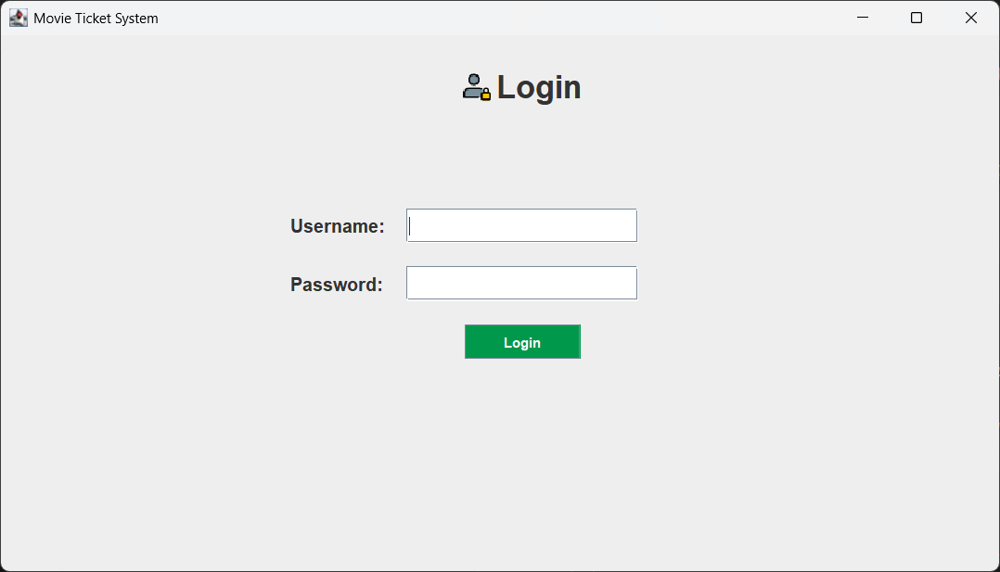
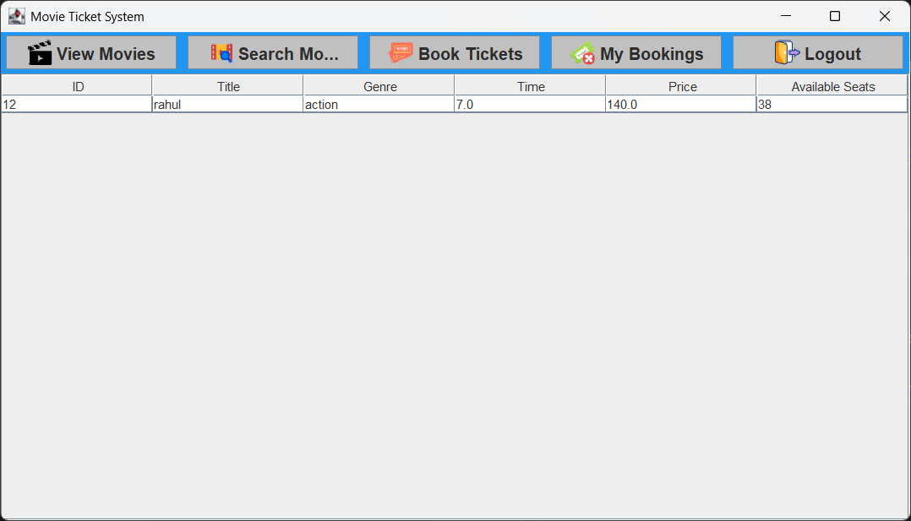
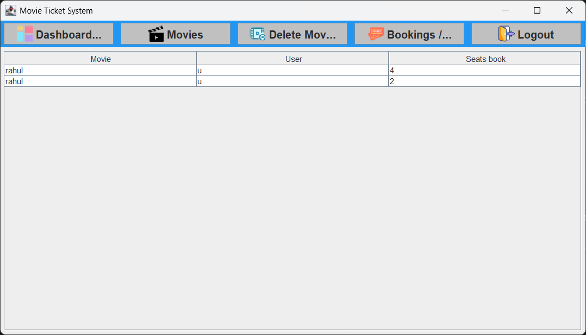
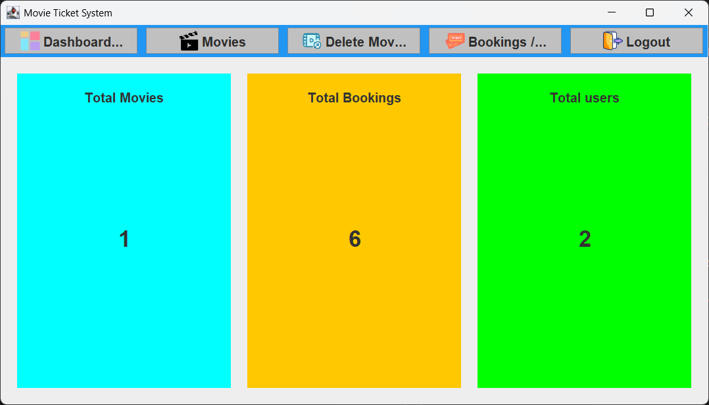

# 🎬 Movie Ticket System (Java Swing + JDBC)

A desktop-based **Movie Ticket Booking System** built using **Java Swing**, **JDBC**, and **MySQL**.  
The application supports **Admin** and **User** roles with complete booking and management features.

---

## 🚀 Features

### 👤 User
- View available movies  
- Search movies by title or genre  
- Book movie tickets  
- View booked tickets  
- Cancel bookings (automatic seat update)  

### 🛠 Admin
- Admin login  
- Add new movies  
- Delete movies  
- View all bookings  
- Dashboard with:
  - Total movies  
  - Total bookings  
  - Total users  

---

## 🧰 Tech Stack

- Java (Core + Swing)  
- JDBC  
- MySQL  
- Git & GitHub  

---
---

## 🖼 Screenshots

### 🔐 Login Screen


### 🎟 User – View & Book Movies


### 🗂 Admin – View Bookings


### 📊 Admin Dashboard


---

## 🗂 Project Structure

---

## 🗄 Database Setup

1. Open **MySQL**
2. Run the following SQL script:

```sql
CREATE DATABASE MTS;
USE MTS;

CREATE TABLE users (
    id INT AUTO_INCREMENT PRIMARY KEY,
    username VARCHAR(15) NOT NULL,
    password VARCHAR(15) NOT NULL,
    role ENUM('admin','user') NOT NULL
);

INSERT INTO users (username, password, role)
VALUES ('admin', 'admin123', 'admin'),
       ('user', 'user123', 'user');

CREATE TABLE movies (
    id INT AUTO_INCREMENT PRIMARY KEY,
    title VARCHAR(200),
    genre VARCHAR(100),
    time VARCHAR(50),
    price DECIMAL(10,2),
    seats INT
);

CREATE TABLE bookings (
    id INT AUTO_INCREMENT PRIMARY KEY,
    movie VARCHAR(255) NOT NULL,
    user VARCHAR(255) NOT NULL,
    seats_book INT NOT NULL
);


**Done**

---

## ▶️ How to Run

1. Clone the repository            
2. Open the project in IntelliJ / Eclipse / NetBeans  
3. Import MySQL Connector (JDBC)  
4. Run the SQL script in MySQL  
5. Update database credentials in the Java file  
6. Run `MovieTicketSystemUI.java`

---
